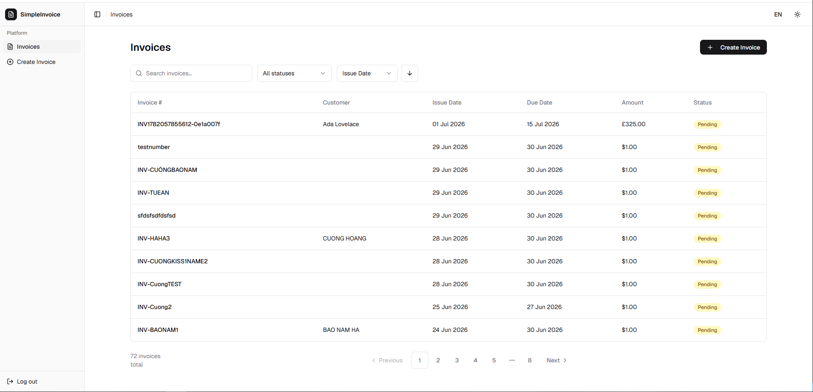

# SimpleInvoice



> **101 Digital Web Engineer Assessment** — v2.2.4  
> A production-grade invoicing web application built on Next.js 16, React 19, and TypeScript 5.

**Live demo:** https://simpleinvoice-web.vercel.app

---

## Table of Contents

1. [Overview](#overview)
2. [Architecture](#architecture)
   - [Feature-Sliced Hexagonal (FSH)](#feature-sliced-hexagonal-fsh)
   - [Dependency Rule](#dependency-rule)
   - [Monorepo Structure](#monorepo-structure)
   - [BFF Security Model](#bff-security-model)
3. [Tech Stack](#tech-stack)
4. [Project Structure](#project-structure)
5. [Getting Started](#getting-started)
6. [Running Tests](#running-tests)
7. [Available Scripts](#available-scripts)
8. [Environment Variables](#environment-variables)
9. [Security Design](#security-design)
10. [Internationalization](#internationalization)
11. [Design Decisions](#design-decisions)

---

## Overview

SimpleInvoice is a fully responsive web application that allows authenticated users to:

- **Login** via OAuth2 password grant (proxied through the BFF — credentials never leave the server)
- **List invoices** with search, sorting, filtering by status, and pagination
- **Create invoices** with a single line item, date validation, and real-time form feedback
- **View invoice detail** by clicking any row in the invoice list

All communication with the 101 Digital API is proxied through Next.js Route Handlers. The browser never holds or transmits authentication tokens directly.

---

## Architecture

### Feature-Sliced Hexagonal (FSH)

This project combines three complementary architectural patterns:

| Pattern                          | What it provides                                                                                                                                                    |
| -------------------------------- | ------------------------------------------------------------------------------------------------------------------------------------------------------------------- |
| **Hexagonal (Ports & Adapters)** | Domain logic is framework-agnostic. External systems implement typed ports. Dependency inversion is enforced at the package boundary.                               |
| **Feature-Sliced Design (FSD)**  | Code is organised vertically by business feature, then horizontally by concern (ui / model / api). Each feature slice is self-contained and independently testable. |
| **Monorepo (Turborepo)**         | Pure domain logic lives in `packages/domain` — zero React/Next.js dependencies. A future mobile or desktop app can reuse the same domain without modification.      |

### Dependency Rule

```
shared ← entities ← features ← widgets ← pages/app
domain ← application ← infrastructure ← presentation
```

Outer layers import from inner layers. The reverse is enforced by `eslint-plugin-boundaries` — a failing lint check is a dependency violation, caught in CI before it reaches review.

### Monorepo Structure

```
simpleinvoice/
├── apps/
│   └── web/                    # Next.js 16 — primary deliverable
│
└── packages/
    ├── domain/                  # Pure TypeScript — zero framework deps
    │   └── src/
    │       ├── invoice/         # Invoice entity, repository port, use cases
    │       ├── auth/            # AuthToken value object, AuthPort, LoginUseCase
    │       └── shared/          # Result<T,E> — replaces throw/catch at boundaries
    │
    ├── api-contracts/           # Zod schemas + shared types (used by both BFF and client)
    └── config/                  # Shared tsconfig, eslint base
```

### BFF Security Model

```
Browser                    Next.js BFF (server)               101 Digital
  │                               │                                │
  │──POST /api/auth/login────────▶│                                │
  │  { username, password }       │──POST /oauth2/token───────────▶│
  │                               │  { client_id, client_secret,   │
  │                               │    username, password }         │
  │                               │◀──{ access_token }─────────────│
  │                               │──GET /membership-service───────▶│
  │                               │◀──{ memberships[0].token }─────│
  │◀──Set-Cookie──────────────────│                                │
  │   access_token=...; HttpOnly  │                                │
  │   org_token=...;   HttpOnly   │                                │
  │                               │                                │
  │──GET /api/invoices───────────▶│                                │
  │  (cookie auto-sent)           │──GET /invoice-service─────────▶│
  │                               │◀──{ invoices }─────────────────│
  │◀──{ invoices }────────────────│                                │
```

The browser only ever speaks to `*.simpleinvoice-web.vercel.app`. 101 Digital tokens are stored in `HttpOnly; Secure; SameSite=Strict` cookies — invisible to JavaScript, immune to XSS.

---

## Tech Stack

| Concern                | Choice                               | Rationale                                                                            |
| ---------------------- | ------------------------------------ | ------------------------------------------------------------------------------------ |
| Framework              | Next.js 16 (App Router)              | RSC + Route Handlers = native BFF with zero extra server                             |
| Language               | TypeScript 5 (strict)                | Compile-time correctness across all packages                                         |
| Styling                | Tailwind CSS v4 + shadcn/ui          | Headless, accessible, token-based design system                                      |
| Server state           | TanStack Query v5                    | Caching, background refetch, pagination with minimal boilerplate                     |
| Forms                  | React Hook Form + Zod                | Perf-first, schema-driven — single source of truth between client and BFF validation |
| Client state           | Zustand                              | Minimal footprint; no provider ceremony                                              |
| Auth storage           | HttpOnly cookies                     | XSS-safe by design; meets assessment security requirement                            |
| Monorepo               | Turborepo + pnpm workspaces          | Incremental builds, task graph, remote caching ready                                 |
| Unit/Integration tests | Vitest + React Testing Library + MSW | Fast, browser-realistic, no real network                                             |
| E2E tests              | Playwright (Chromium)                | Golden path + auth flow against a running dev server                                 |
| i18n                   | next-intl                            | URL-based locale routing (`/en/...`, `/vi/...`)                                      |
| Theme                  | next-themes                          | Dark / light / system with zero flash on load                                        |

---

## Project Structure

```
apps/web/src/
│
├── app/                                    # Next.js App Router
│   ├── [locale]/
│   │   ├── (auth)/login/page.tsx           # Public login page
│   │   └── (dashboard)/
│   │       ├── layout.tsx                  # Protected layout — checks cookie
│   │       └── invoices/
│   │           ├── page.tsx                # Invoice list (default home)
│   │           ├── new/page.tsx            # Create invoice
│   │           └── [id]/page.tsx           # Invoice detail
│   └── api/                               # BFF Route Handlers (server-only)
│       ├── auth/login/route.ts            # POST → proxies to /oauth2/token
│       ├── auth/logout/route.ts           # Clears HttpOnly cookies
│       ├── user/profile/route.ts          # GET → proxies to /membership-service
│       └── invoices/
│           ├── route.ts                   # GET list | POST create
│           └── [id]/route.ts              # GET single invoice
│
├── features/                              # User interaction slices
│   ├── auth/                              # Login form + useLogin hook
│   ├── create-invoice/                    # Create form + useCreateInvoice hook
│   ├── list-invoices/                     # useInvoiceList (TanStack Query)
│   ├── search-invoices/                   # Search bar + useInvoiceSearch
│   └── view-invoice/                      # Invoice detail display
│
├── widgets/                               # Composed UI blocks (no business logic)
│   ├── app-shell/                         # DashboardShell, AppSidebar, DashboardHeader
│   ├── invoice-table/                     # Data table with sort/pagination
│   └── invoice-filters/                   # Status filter + date range
│
├── entities/                              # Business entity UI representations
│   └── invoice/                           # InvoiceStatusBadge, Zod schema, types
│
├── shared/                                # Reusable code with no business logic
│   ├── ui/                               # DatePicker, ThemeToggle, LanguageSwitcher
│   ├── api/bff-client.ts                 # Typed fetch() wrapper — /api/* only
│   └── lib/                              # format-currency, format-date
│
├── infrastructure/                        # Hexagonal adapters (server-only)
│   ├── 101digital/
│   │   ├── AuthAdapter.ts                # implements AuthPort
│   │   └── InvoiceAdapter.ts             # implements InvoiceRepository
│   └── storage/SessionCookieStore.ts     # HttpOnly cookie read/write
│
└── __tests__/                             # Test infrastructure
    ├── msw/                              # MSW server + handlers (integration)
    ├── security/                         # BFF security boundary tests
    └── mocks/                            # server-only no-op mock
```

---

## Getting Started

### Prerequisites

- **Node.js** ≥ 20
- **pnpm** ≥ 9 (`npm install -g pnpm`)

### 1. Clone and install

```bash
git clone https://github.com/cinblockchain91/simpleinvoice.git
cd simpleinvoice
pnpm install
```

### 2. Configure environment variables

```bash
cp apps/web/.env.example apps/web/.env.local
```

Open `apps/web/.env.local` and fill in the 101 Digital sandbox credentials:

```env
DIGITAL_CLIENT_ID=qlsGKsgR3Qt4M_oSAvRq2yChEpUa
DIGITAL_CLIENT_SECRET=GE7sxz9a4J6bw9LyPxkr4syV6pdLiMvYu2o_fDfnWgUa
DIGITAL_AUTH_BASE_URL=https://is-wso2-dev.101digital.io
DIGITAL_API_BASE_URL=https://api-neobank-dev.101digital.io
```

> These values are from the assessment Appendix A. Never commit `.env.local`.

### 3. Start the development server

```bash
pnpm dev
```

Open [http://localhost:3000](http://localhost:3000). You will be redirected to `/en/login`.

**Login credentials (sandbox):**

| Field    | Value            |
| -------- | ---------------- |
| Username | `94756921275`    |
| Password | `Password@12345` |

---

## Running Tests

### Unit tests

Fast, no network, no filesystem. Runs in jsdom via Vitest + React Testing Library.

```bash
pnpm test
```

### Integration tests

Tests the hexagonal adapters against MSW-intercepted HTTP. Runs in Node.js — no browser, no Next.js runtime.

```bash
pnpm test:integration
```

Key coverage:

- `AuthAdapter` — token exchange, error handling (401, 5xx)
- `InvoiceAdapter` — list pagination, status filter mapping, create payload, error propagation
- BFF Route Handlers — `POST /api/auth/login`, `GET /api/invoices`, `POST /api/invoices`
- Security boundary — verifies tokens are set as HttpOnly cookies (not returned in JSON body)

### E2E tests (Playwright)

Full golden path against a running dev server. Requires a `.env.local` with valid credentials.

```bash
pnpm test:e2e
```

Covers:

- Login → redirect to invoice list
- Create invoice → success toast → list reflects new invoice
- Unauthenticated access → redirect to login

### Type checking

```bash
pnpm type-check
```

Runs `tsc --noEmit` across all packages in dependency order via Turborepo. This also runs as a pre-push git hook — a broken type is a blocked push.

---

## Available Scripts

All commands run from the **monorepo root**:

| Command                 | Description                                               |
| ----------------------- | --------------------------------------------------------- |
| `pnpm dev`              | Start Next.js dev server with HMR                         |
| `pnpm build`            | Production build (all packages, in dependency order)      |
| `pnpm lint`             | ESLint across all packages (includes FSD boundary checks) |
| `pnpm lint:fix`         | Auto-fix lint errors                                      |
| `pnpm type-check`       | TypeScript strict check across all packages               |
| `pnpm test`             | Unit tests (Vitest)                                       |
| `pnpm test:integration` | Integration tests (Vitest + MSW, Node environment)        |
| `pnpm test:e2e`         | E2E tests (Playwright, requires running dev server)       |
| `pnpm format`           | Prettier — formats all `.ts`, `.tsx`, `.md`, `.json`      |

---

## Environment Variables

All variables are **server-only**. None use the `NEXT_PUBLIC_` prefix. The `env.server.ts` module validates them at startup and throws a descriptive error if any are missing — the app will not boot with an incomplete config.

| Variable                | Required | Description                                         |
| ----------------------- | -------- | --------------------------------------------------- |
| `DIGITAL_CLIENT_ID`     | Yes      | OAuth2 client ID for the 101Digital identity server |
| `DIGITAL_CLIENT_SECRET` | Yes      | OAuth2 client secret — never exposed to the browser |
| `DIGITAL_AUTH_BASE_URL` | Yes      | Base URL for `/oauth2/token` (WSO2 IS host)         |
| `DIGITAL_API_BASE_URL`  | Yes      | Base URL for invoice-service and membership-service |

---

## Security Design

| Control                          | Implementation                                                                                                                   |
| -------------------------------- | -------------------------------------------------------------------------------------------------------------------------------- |
| **Server-side token exchange**   | `/api/auth/login` proxies to `/oauth2/token`. `client_secret` is read server-side only.                                          |
| **No secrets in client bundle**  | Zero `NEXT_PUBLIC_` env vars. Secrets validated in `env.server.ts` which imports `server-only`.                                  |
| **HttpOnly cookies**             | `access_token` and `org_token` set with `HttpOnly; Secure; SameSite=Strict`. Unreadable by JavaScript.                           |
| **BFF proxy**                    | Every call to `invoice-service` and `membership-service` passes through `/api/*`. The browser only talks to its own origin.      |
| **Server-side input validation** | Zod validates all Route Handler inputs (query params and request bodies) independently of client-side validation.                |
| **Security headers**             | Configured in `next.config.ts`: CSP, `X-Frame-Options`, `X-Content-Type-Options`, HSTS, `Referrer-Policy`, `Permissions-Policy`. |
| **Secrets hygiene**              | `.env.local` is git-ignored. `.env.example` is committed with placeholder values only.                                           |
| **Security boundary tests**      | `apps/web/src/__tests__/security/bff-security.test.ts` asserts that tokens are never returned in API response bodies.            |

---

## Internationalization

The application supports **English** and **Vietnamese** via URL-based locale routing:

| URL         | Locale     |
| ----------- | ---------- |
| `/en/login` | English    |
| `/vi/login` | Vietnamese |

Navigating to `/` or `/login` redirects to the browser's preferred locale (falls back to `en`).

Translation files live in `apps/web/messages/{en,vi}.json`. All UI strings — labels, placeholders, error messages, navigation — are fully translated.

A **Language Switcher** in the header allows manual locale selection without reloading authentication state.

---

## Design Decisions

### Why hexagonal architecture for a "simple" app?

The assessment explicitly requires code quality at a production-engineering level. Hexagonal architecture enforces two properties that matter under evaluation:

1. **Testability without mocks of implementation details** — `packages/domain` use cases are tested with plain in-memory fakes, not mocked framework internals.
2. **Portability** — the same domain package could power a React Native mobile app with zero changes.

### Why a separate `packages/domain`?

The domain layer has no `package.json` dependency on React, Next.js, or any browser API. This is verified by the TypeScript compiler: if an accidental import were added, the `packages/domain:type-check` task would fail.

### Why TanStack Query instead of `fetch` in Server Components?

The invoice list requires client-side interactivity: search, filter, sort, and pagination all update the list without a full page reload. TanStack Query provides cache invalidation (the list auto-refreshes after a successful create), background refetch, and loading/error state — all with less boilerplate than `useEffect` + manual state.

### Why MSW for integration tests instead of hitting the real API?

Integration tests that hit a shared sandbox are slow, flaky (network-dependent), and pollute shared state (every run creates real invoices). MSW intercepts at the `fetch` level in Node.js — the adapters exercise real HTTP parsing logic against a controlled, deterministic API surface.

### Why `Result<T, E>` instead of `try/catch`?

Domain errors (`InvoiceFetchError`, `InvoiceCreateError`, `InvoiceNotFoundError`) are modelled as typed discriminated unions returned by the repository. This makes error handling explicit at call sites and prevents uncaught exceptions from propagating across architectural boundaries. TypeScript's exhaustiveness checking catches unhandled error variants at compile time.
